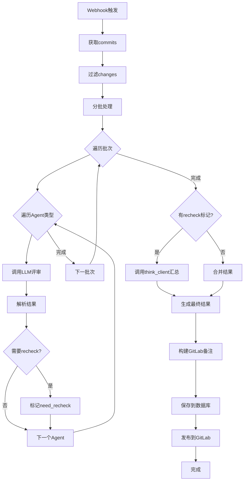

# 代码评审服务主流程还原

根据生产环境代码还原的主流程逻辑

## 一、整体架构

```
Webhook触发 → code_review() → 多Agent并行评审 → merge_agent_results() → 输出到GitLab
```

## 二、核心流程代码

### 1. 入口函数：`code_review()`

```python
def code_review(handler: MergeRequestHandler, is_add_note=None, is_send_msg=None):
    """
    MR代码评审主入口
    :param handler: MergeRequestHandler
    :param is_add_note: 是否添加评审备注到GitLab
    :param is_send_msg: 是否发送消息通知
    """
    
    # 1. 获取基本信息
    commits = handler.get_merge_request_commits()
    if not commits:
        _skip_task(task, error_info: "未获取到commit信息", handler, is_add_note)
        return
    
    # 2. 检查并过滤changes（只评审关注的文件类型）
    cr_changes = filter_and_handle_changes(changes)
    if not cr_changes:
        _skip_task(task, error_info: "未检测到需要REVIEW的代码", handler, is_add_note)
        return
    
    # 3. 核心评审流程
    agent_results_list, merge_results, error_info = handle_mr_code(
        handler, cr_changes, commits, formatted_changes
    )
    
    # 4. 生成GitLab评审备注
    if is_add_note and handler.action != 'test':
        notes = _build_gitlab_notes(agent_results_list, merge_results)
        handler.add_merge_request_notes(''.join(notes))
    else:
        logger.info(f"Merge Request Hook event, action={handler.action}, 不进行评审，只更新信息。*")
        update_statistics_rating_merge_status(handler.webhook_data)
    
    # 5. 错误处理和任务记录
    if error_info:
        fail_task_info(task.task_id, error_info)
    else:
        success_task_info(task.task_id)
```

### 2. 核心处理：`handle_mr_code()`

```python
def handle_mr_code(handler: MergeRequestHandler, original_changes=None, 
                   commits=None, formatted_changes:list=None):
    """
    处理MR代码的核心逻辑
    :return: agent_results_list, merge_results, error_info
    """
    
    # 1. 初始化
    small_client = CodeReviewer(handler.client)
    start_time = time.time()
    
    # 2. 代码分批处理
    cr_changes_list = split_changes(original_changes, int(os.getenv('CONTENT_MAX_LENGTH', 5000)))
    
    commits_text = ';'.join([commit['title'] for commit in commits])
    agent_results_list = []
    
    # 是否启用思考链（多Agent模式）
    include_thought_chain = False
    error_info = ""
    batch_num = len(cr_changes_list)
    
    if batch_num > 1:
        include_thought_chain = False  # 批次多时不启用思考
    
    # 3. 遍历每个批次的代码
    for i, cr_changes in enumerate(cr_changes_list[:max_batch]):
        agent_results = {}
        ast_content = None
        need_recheck = False
        agent_type = ""
        batch_id = str(i+1)
        
        logger.info(f"开始分片评审处理, 共 {batch_num} 个分片, 当前处理第 {batch_id} 片")
        
        # 4. 遍历每种Agent类型（general, security等）
        for agent_type in agent_types:
            
            # 如果需要AST上下文（前次评审要求）
            if ast_content is None and os.getenv('AGENT_AST_' + agent_type.upper(), 'false').lower() == 'true':
                # 调用获取AST上下文
                pass
            
            # 5. 调用LLM进行评审
            review_result, error_info = get_review_result(
                small_client,
                diffs_text=str(cr_changes), 
                commits_text=commits_text,
                agent_type=agent_type,
                include_thought_chain=include_thought_chain,
                ast_content=ast_content,
                batch_num=batch_num,
                batch_id=batch_id,
                error_info=error_info,
                agent_results=agent_results
            )
            
            # 6. 解析评审结果
            agent_results[agent_type] = parse_review_result(
                review_result=review_result, 
                task=task, 
                agent_type=agent_type, 
                batch_num=batch_num, 
                batch_id=batch_id
            )
            
            # 7. 检查是否需要recheck
            if not need_recheck:
                need_recheck = agent_results[agent_type].need_recheck
        
        logger.info(f"完成分片评审处理, 共 {batch_num} 个分片, 当前处理第 {batch_id} 片, Agent results: {str(agent_results)}")
        
        agent_results_list.append(agent_results)
    
    # 8. 如果需要recheck，进行二次评审
    if need_recheck:
        # think_client = get_think_client()
        
        # 构建评审摘要提示
        prompt = "请对以下多个分片的评审结果进行综合分析。\n\n"
        
        for i, agent_results in enumerate(agent_results_list):
            recheck_result = agent_results.get('recheck')
            if recheck_result:
                prompt += f"第{i+1}个分片的评审结果: {recheck_result.review_result}\n\n*"
        
        prompt += """请综合所有分片的评审结果, 最终给出精炼的评审
请以JSON格式返回结果***"""
        
        try:
            # 调用大模型进行汇总评审
            merged_result = think_client.direct_review(prompt)
            score = ""
            logger.info(f"大模型汇总结果: {merged_result}")
            
            if not merged_result:
                logger.warning("合并评审结果为空")
                return {
                    "status": "1",
                    "result": "合并评审结果为空, 请检查大模型返回内容",
                    "score": ""
                }
            
            try:
                score = rating_parse_util.extract_score_v2(merged_result).score
            except Exception as e:
                logger.warning(f"解析汇总结果失败: {str(e)}")
            
            logger.info(f"汇总结果: {merged_result}")
            return {
                "status": "0",
                "result": merged_result,
                "score": score
            }
            
        except Exception as e:
            logger.error(f"合并评审结果失败: {str(e)}")
            return {
                "status": "1",
                "result": "汇总评审结果失败, 参考评审过程",
                "score": ""
            }
    
    # 9. 合并多个Agent的评审结果
    merge_results = merge_agent_results(agent_results_list)
    end_time = time.time()
    
    return agent_results_list, merge_results, error_info
```

### 3. LLM调用：`get_review_result()`

```python
def get_review_result(client, diffs_text, commits_text, agent_type, 
                     include_thought_chain, ast_content, batch_num, 
                     batch_id, error_info, agent_results=None):
    """
    调用LLM进行代码评审
    :param client: LLM客户端
    :param diffs_text: diff代码
    :param commits_text: 提交信息
    :param agent_type: Agent类型(general, security, recheck等)
    :param include_thought_chain: 是否包含思考链
    :param ast_content: AST上下文
    :param batch_num: 总批次数
    :param batch_id: 当前批次ID
    :param error_info: 错误信息累积
    :param agent_results: 其他Agent的结果（用于recheck）
    :return: review_result, error_info
    """
    try:
        # 调用CodeReviewer进行评审
        review_result = client.review_code(
            diffs_text=str(diffs_text), 
            commits_text=commits_text,
            agent_type=agent_type,
            include_thought_chain=include_thought_chain, 
            ast_content=ast_content,
            agent_results=agent_results
        )
        
        return review_result, error_info
        
    except Exception as e:
        stack_trace = traceback.format_exc()
        
        # 大模型请求失败, 共 {batch_num} 个分片, 当前Agent类型: {agent_type}, 当前处理第 {batch_id} 片
        tmp_error_info = f"\n大模型请求失败, 共 {batch_num} 个分片, 当前Agent类型: {agent_type}, 当前处理第 {batch_id} 片"
        error_info += tmp_error_info
        logger.error(tmp_error_info + stack_trace)
        
        return review_result, error_info
```

### 4. 结果解析：`parse_review_result()`

```python
def parse_review_result(review_result, task, agent_type, batch_num, batch_id):
    """
    解析LLM返回的评审结果
    :param review_result: LLM返回的原始文本
    :param task: 任务对象
    :param agent_type: Agent类型
    :param batch_num: 批次总数
    :param batch_id: 当前批次ID
    :return: AgentResult对象
    """
    
    if not review_result:
        logger.warning(f"review结果为空, 直接返回缺认结果, 共 {batch_num} 个分片, 当前处理第 {batch_id} 片")
        return AgentResult(
            review_result=review_result,
            question_list=[],
            question_list_str="",
            overall_score=Score(-1, -1),
            need_recheck=False,
            extract_json=""
        )
    
    # 初始化
    question_list = []
    if extract_json:
        # 从JSON中解析问题列表
        question_list = Question.parse_rating_questions(
            task_id=task.task_id, 
            rating_info=review_result,
            agent_type=agent_type, 
            batch_id=str(batch_id),
            extract_json=extract_json
        )
        overall_score = rating_parse_util.extract_score_v2(extract_json)
    
    if question_list:
        need_recheck = True
        question_list_str += '\n'.join([str(q) for q in question_list])
    
    logger.info(
        f"提取json数据, 共 {batch_num} 个分片, agent_type: {agent_type}, 当前处理第 {batch_id} 片, json: {json.dumps(extract_json, separators=(',', ':'))}"
    )
    
    return AgentResult(
        review_result=review_result, 
        question_list=question_list,
        question_list_str=question_list_str,
        overall_score=overall_score,
        need_recheck=need_recheck,
        extract_json=extract_json
    )
```

### 5. 结果合并：`merge_agent_results()`

```python
def merge_agent_results(agent_results_list):
    """
    合并多个Agent的评审结果
    :param agent_results_list: 多个批次的Agent结果列表
    :return: 合并后的结果字典
    """
    
    # 收集所有recheck结果
    recheck_results = []
    
    for agent_results in agent_results_list:
        recheck_result = agent_results.get('recheck')
        if recheck_result:
            recheck_results.append(recheck_result)
    
    if not recheck_results:
        # 情况1: 没有需要复核的问题
        return {
            "status": "0",
            "result": "通过通过",
            "score": "10"
        }
    
    if len(recheck_results) == 1:
        # 情况2: 只有一个复核结果
        recheck_result = recheck_results[0]
        if recheck_result and hasattr(recheck_result, 'extract_json'):
            return {
                "status": "0",
                "result": recheck_result.extract_json,
                "score": recheck_result.score
            }
    
    else:
        # 情况3: 多个复核结果需要合并
        return {
            "status": "1",
            "result": "汇总评审结果暂未完成, 参考评审过程",
            "score": ""
        }
    
    try:
        score = rating_parse_util.extract_score_v2(merged_result).score
    except Exception as e:
        logger.warning(f"解析汇总结果失败: {str(e)}")
    
    logger.info(f"汇总结果: {merged_result}")
    return {
        "status": "0",
        "result": merged_result,
        "score": score
    }
```

### 6. 结果持久化：`save_parse_result()`

```python
def save_parse_result(agent_results_list, cr_changes_list, task, 
                     start_time, end_time, handler, merge_results):
    """
    保存评审结果到数据库和统计系统
    :param agent_results_list: Agent结果列表
    :param cr_changes_list: 代码变更列表
    :param task: 任务对象
    :param start_time: 开始时间
    :param end_time: 结束时间
    :param handler: MergeRequestHandler
    :param merge_results: 合并后的结果
    """
    
    total_content = ""
    total_token = 0
    
    for cr_changes in cr_changes_list[:max_batch]:
        content_str = str(cr_changes)
        total_content += content_str
        total_token += token_length(content_str)
    
    content_size = len(total_content)
    token_size = total_token
    send_content_size = content_size
    send_token_size = token_size
    
    # 提取各维度的评审内容
    general_contents = []
    general_score = 10
    general_questions = []
    security_contents = []
    security_questions = []
    security_score = 10
    recheck_contents = []
    recheck_questions = None
    recheck_score = 10
    
    # None表示没有提问题
    for agent_results in agent_results_list:
        general_res = agent_results.get('general')
        security_res = agent_results.get('security')
        recheck_res = agent_results.get('recheck')
        
        if general_res:
            general_contents.append(general_res.review_result)
            general_questions.extend(general_res.question_list)
            general_score = min(general_score, general_res.score)
        
        if security_res:
            security_contents.append(security_res.review_result)
            security_questions.extend(security_res.question_list)
            security_score = min(security_score, security_res.score)
        
        if recheck_res:
            if recheck_res.question_list is not None:
                recheck_questions = []
            recheck_contents.append(recheck_res.review_result)
            
            if recheck_res.question_list is not None:
                recheck_questions.extend(recheck_res.question_list)
            
            if merge_results.get('score'):
                recheck_score = merge_results.get('score')
            else:
                recheck_score = min(recheck_score, recheck_res.score)
    
    # 构建完整的评审内容
    merge_content = merge_results.get("result") or ""
    total_score = merge_results.get("score") or "**"
    
    general_score_text, security_score_text, recheck_score_text = (
        total_score, general_score, security_score, recheck_score,
        start_time, end_time,
        ExtendData(handler.client.model_name(), content_size, send_content_size,
                  token_size, send_token_size)
    )
    
    logger.info(f"保存merge rating结果, task_id: {task.task_id}")
```

### 7. 生成GitLab备注：`_build_gitlab_notes()`

```python
def _build_gitlab_notes(agent_results_list, merge_results:str=""):
    """
    构建GitLab注释内容, 每类agent的评审结果，可检测到有问题
    """
    
    notes = []
    result_value = merge_results.get("result", "")
    merge_score = merge_results.get("score", "**")
    think_content = ""
    post_think = ""
    
    if not result_value:
        logger.error(f"空的汇总评审结果")
        result_value = "合并评审结果为空, 请检查大模型返回内容"
    
    if result_value:
        # 使用正则提取 <think> 和 </think> 之间的内容
        think_match = re.search(r'<think>(.*?)</think>', result_value, re.DOTALL)
        if think_match:
            think_content, post_think = think_match.groups()
            think_content = think_content.strip()
            post_think = post_think.strip()
        else:
            # 如果没有 <think> 标签, 全部算作 post_think
            think_content = ''
            post_think = result_value.strip()
    
    # === 处理评审结果: 由 post_think 组成 ===
    notes.append(f"# 📊 评审结果: ")
    
    if merge_score:
        notes.append(f"{merge_score}分\n\n")
    else:
        notes.append(f"\n\n")
    
    if post_think:
        # 确保没有正则把代码删除了
        has_code_block = re.match(r'^```json\n{post_think}\n```', post_think, re.DOTALL) is not None
        if not has_code_block:
            post_think = post_think.replace("```", "\\'\\'")
        # 确保该格式加上 JSON 代码格式化
        post_think = f"```json\n{post_think}\n```"
        
        stripped_post = post_think.rstrip('\n')
        if not stripped_post.endswith('```'):
            post_think += '\n```'
        
        # 翻译成统一格式: 由 post_think 组成
        notes.append(f"{post_think}\n\n(~-~ * 80)\n\n")
    else:
        notes.append(f"\n\n")
    
    if think_content:
        notes.append(f"### 🚀 详细过程: \n\n {think_content}\n\n")
    
    notes.append(
        f"## 🎯 本地代码评审共 {len(agent_results_list)} 组, 可按查看各组内的详情\n\n"
    )
    
    # 逐一处理其他 agent (如 general, security 等)
    for i, agent_results in enumerate(agent_results_list):
        
        notes.append(f"\n\n## 📌 第{i+1} 组: \n\n")
        
        # 检查是否有 recheck 内容
        recheck = agent_results.get('recheck', None)
        if recheck:
            content = recheck.review_result
            if content:
                content = content.replace("<think>", "### 💭思考过程详细\n\n")
                content = content.replace("</think>", "### 最终整体思考结束\n\n")
                
                notes.append(f"# ✅ 复核结果: \n\n{content}")
        
        # 再处理其他 agent (如 general, security 等)
        for agent, AgentResult in agent_results.items():
            if agent == "recheck":
                continue  # recheck 已经在前处理
            
            if AgentResult:
                notes.append(
                    rating_parse_util.build_gitlab_note(
                        AgentResult.review_result, AgentResult.question_list, agent
                    )
                )
    
    notes.append("\n</details>")
    return notes
```

## 三、数据结构

### AgentResult

```python
@dataclass
class AgentResult:
    """单个Agent的评审结果"""
    review_result: str          # 原始评审文本
    question_list: List         # 问题列表
    question_list_str: str      # 问题列表字符串
    overall_score: Score        # 总体分数
    need_recheck: bool          # 是否需要复核
    extract_json: str           # 提取的JSON
```

## 四、关键特性

### 1. 多Agent架构

- **general**: 通用代码评审（功能、性能、规范）
- **security**: 安全评审（漏洞、权限）
- **recheck**: 复核评审（汇总前面结果）

### 2. 分批处理

- 代码超长时自动分批（`CONTENT_MAX_LENGTH=5000`）
- 每批独立评审，最后合并

### 3. 思考链模式

- 单批次时启用 `include_thought_chain=True`
- 多批次时禁用以节省token

### 4. AST上下文

- 可选功能，通过 `AGENT_AST_GENERAL` 等环境变量控制
- 提供完整代码上下文辅助评审

### 5. 二次评审（recheck）

- 当评审发现问题时，触发大模型汇总
- 使用 `think_client` 进行深度分析

## 五、流程图



## 六、环境变量配置

```bash
# 内容长度限制
CONTENT_MAX_LENGTH=5000

# Agent类型
AGENT_TYPES=general,security

# AST上下文开关
AGENT_AST_GENERAL=false
AGENT_AST_SECURITY=true

# 批次限制
MAX_BATCH=3

# 是否添加评审备注
NOTE_NEED_ADD=true

# 是否发送消息通知
MSG_NEED_SEND=false
```

## 七、与测试框架的对接点

### 关键方法复用

```python
# 测试时直接调用这个方法
review_result = client.review_code(
    diffs_text=diff_from_testcase,  # 从测试用例读取
    commits_text="测试用例",
    agent_type="general",
    include_thought_chain=False,
    ast_content=None,
    agent_results=None
)
```

### 输入格式

- **diffs_text**: Git diff格式的字符串
- **commits_text**: 提交信息（测试时可用固定值）
- **agent_type**: general/security/recheck

### 输出格式

- 返回JSON字符串，包含：
  - `总分`
  - `问题列表`
  - `各评审项扣分明细`

---

**文档创建时间**: 2025-12-30
**基于生产代码版本**: merge_service.py

